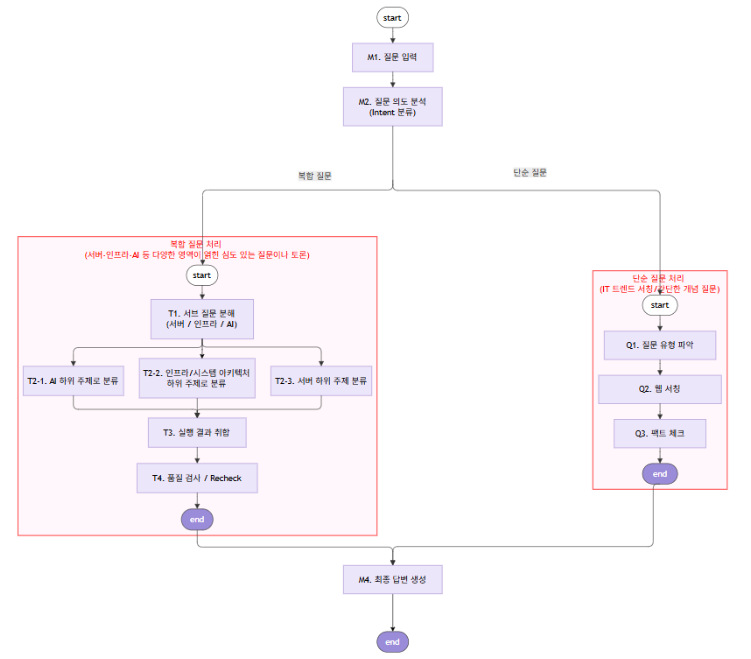
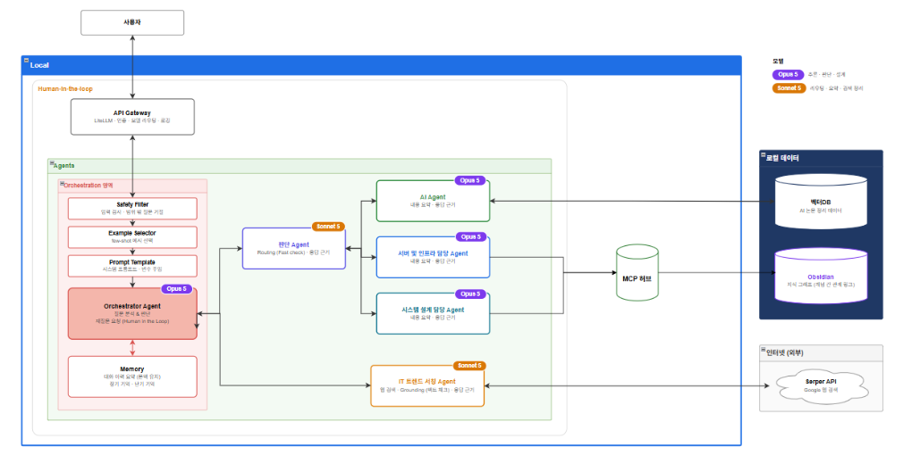
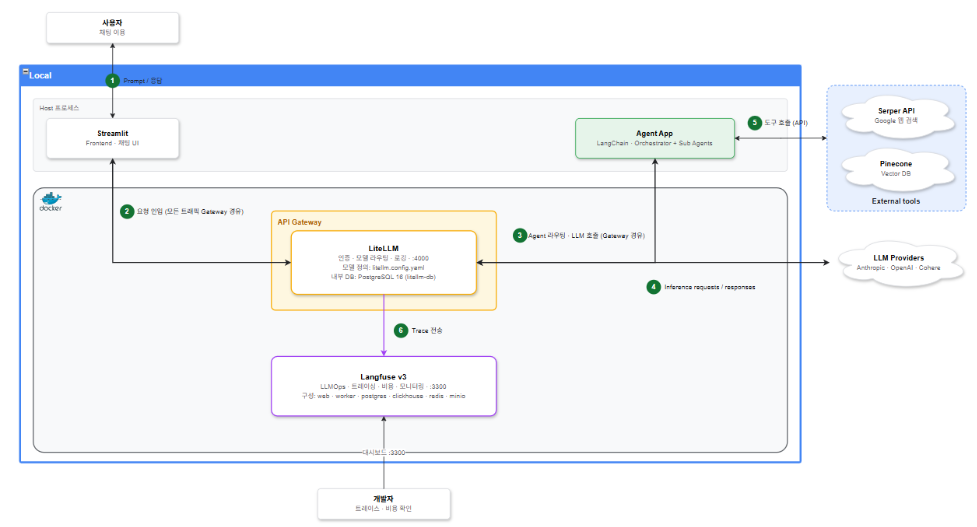

# 안녕, 나의 학습 도우미!

> - 멀티 에이전틱 시스템 구축 
> - LangGraph와 Claude SDK 둘 다 써볼 예정
>   - LangGraph 완료(/app)
>   - Claude SDK 진행중(/app2)

### [1] 워크 플로우 정의

### [2] 멀티 에이전트 아키텍처

### [3] 시스템 아키텍처

### 추가 설명
> - 회사 및 스터디 발표 자료(제작중..): https://canva.link/a392s7cwfyr17f2
